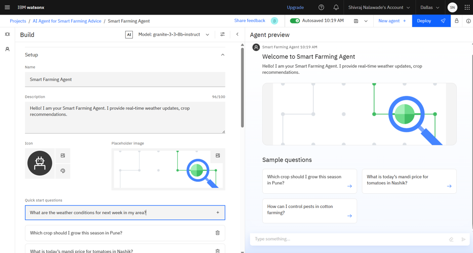
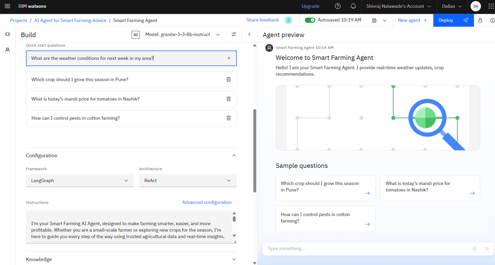
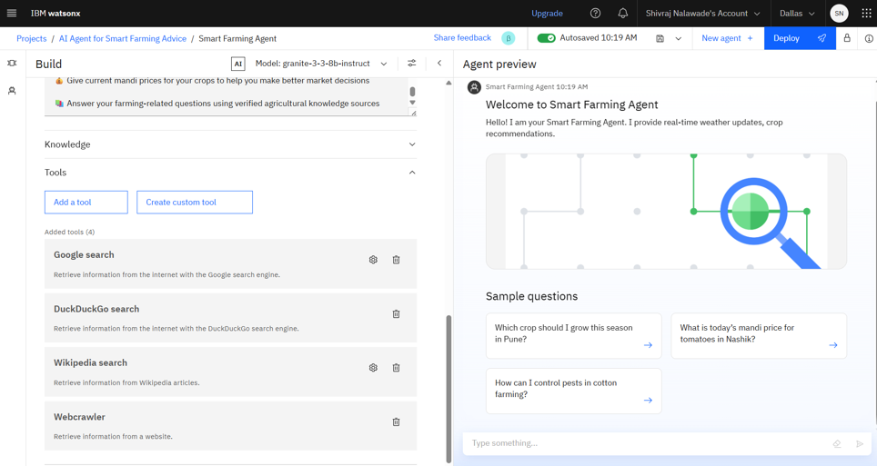
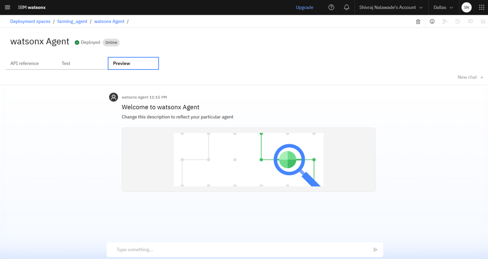
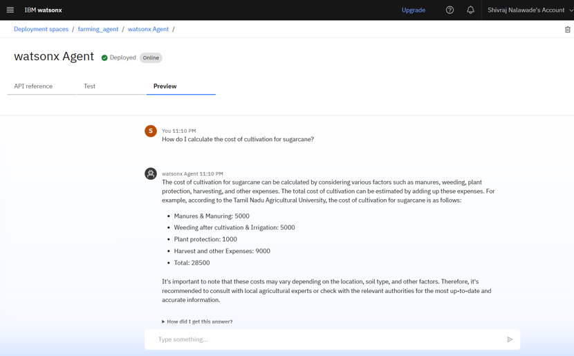
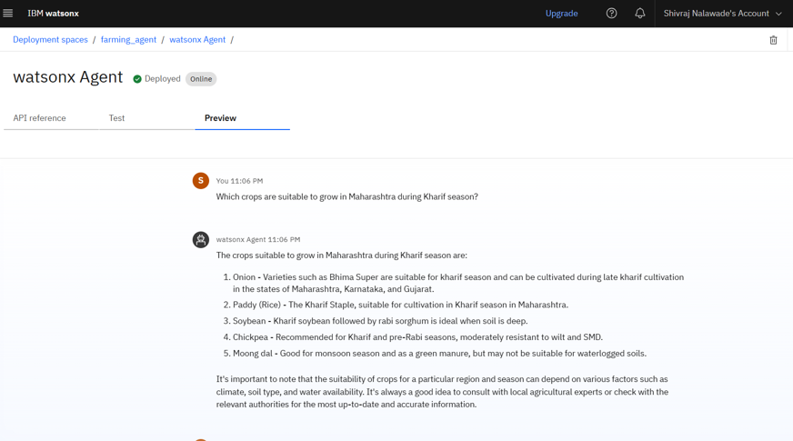
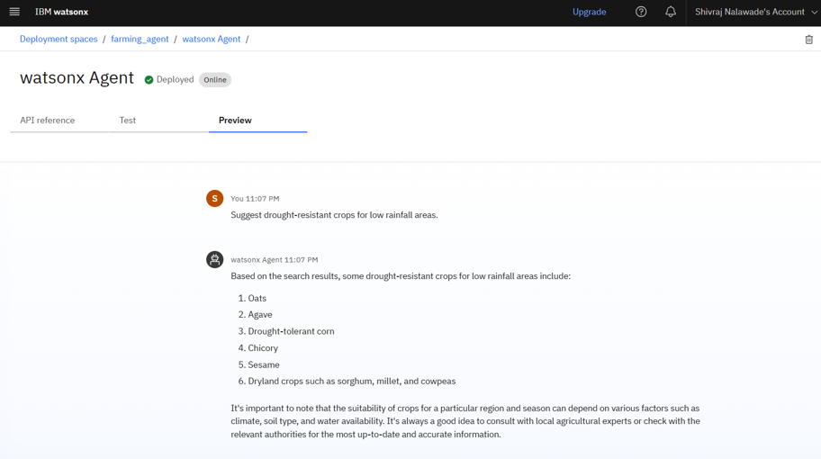
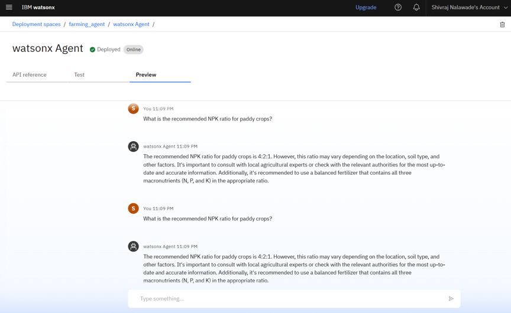

# 🌾 Smart Farming Agent

**An AI-powered assistant for small-scale farmers, built on IBM Watsonx and Granite models**

> **Author:** Shivraj Ramesh Nalawade
> **College:** MIT Academy of Engineering, Alandi, Pune

---

## 📌 Project Overview

The **Smart Farming Agent** helps small-scale farmers make **data-driven decisions** by providing:

* **Localized crop recommendations**
* **Real-time weather forecasts**
* **Pest & disease management guidance**
* **Current mandi (market) prices**

This agent interacts in **English, Hindi, and Marathi**, making it accessible to farmers across regions.

---

## 🚀 Features

* **🤖 AI-Powered:** Built using **IBM Watsonx.ai** and **Granite LLM**
* **📚 Retrieval-Augmented Generation (RAG):** Uses trusted agricultural advisories & market data
* **🌦 Weather-Aware:** Provides **real-time weather-based advice**
* **💰 Mandi Prices:** Fetches current market rates to help with selling decisions
* **🗓 Multilingual:** Supports **English, Hindi, and Marathi** for easy communication
* **👩‍🌾 Simple Interface:** Farmer-friendly conversational design

---

## 🛠️ Tech Stack

* **IBM Watsonx.ai** (Agent Lab, Runtime, Studio)
* **IBM Granite Foundation Model**
* **Retrieval-Augmented Generation (RAG)**

---

## 🎯 End Users

* **Small & Medium-scale Farmers**
* **Agricultural Extension Officers**
* **Agri-Tech Startups**
* **State Agriculture Departments**

---

## 🔮 Future Scope

* **Voice-based interaction** for illiterate farmers
* **IoT integration** with soil & climate sensors
* **Mobile app** for wider accessibility
* **Expanded regional language support**

---

## ⚙️ Setting Up
Here’s how we set up the **Smart Farming Agent** in IBM Watsonx:

---

## 🚀 Quick Start Questions
A preview of the **Quick Start Questions** configured for the agent:

---

## 🧪 Tools Used & Testing 

---

## 📡 Deployment & Preview
Our **deployed agent** running in IBM Watsonx:

---

## 🏗 Deployment of AI Agent
An overview of the **AI Agent Deployment process**:

---

## 📊 Results
Below are some outputs and results from the **Smart Farming Agent**:

